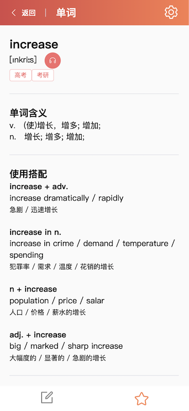

# words study client side mobile

[server side ->>](https://github.com/BlaxBerry/vue3-words-study-server)

## Tech Stacks

[Vue]() v3+

[TypeScript]() v4+

[Vite]() v2+

[Vue-Router]() v4+

[Pinia]() v2+

[Element plus]() v2+

[Sass]()

[Apollo]() v3+

[graphql]()

[Vue-i18n]() v9

## Images

